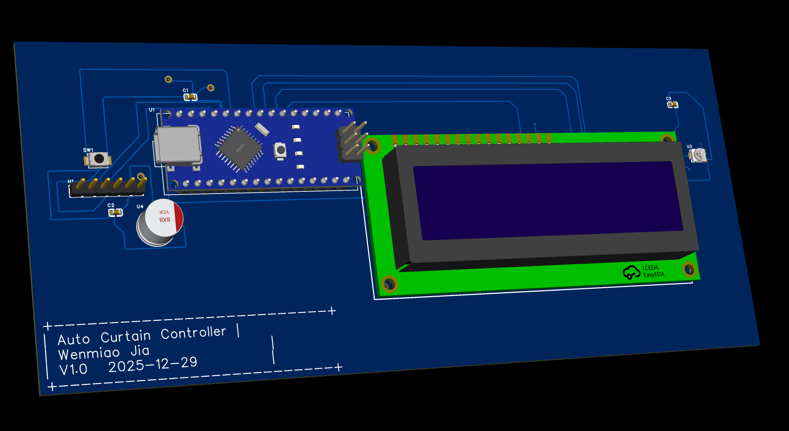
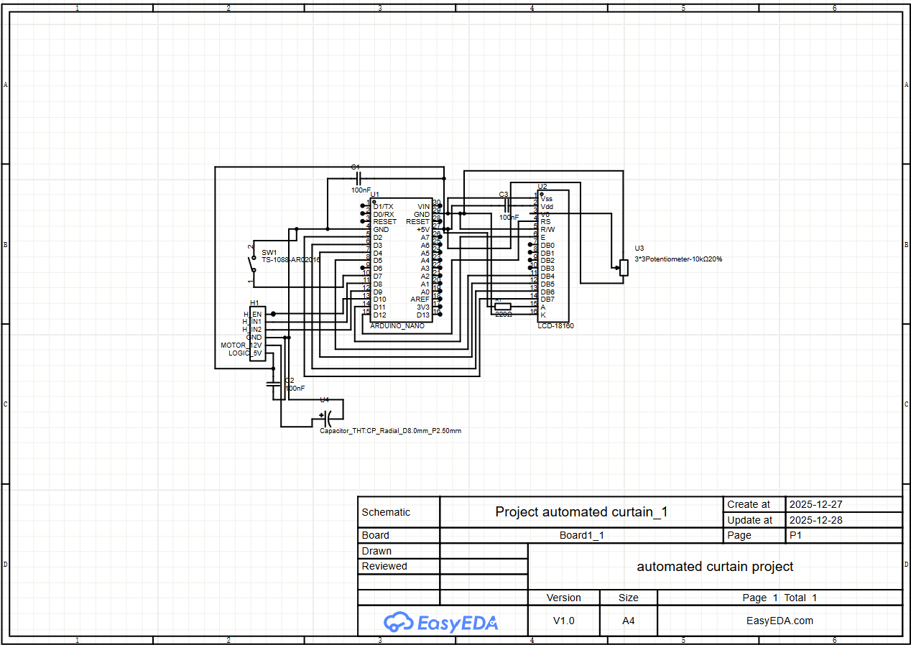

# Smart Curtain project: To control curtain in my dorm's walk in closet
##1. Project Overview
SmartCurtain is a computer engineering project that designed to close a curtain automatically while displaying the status of the walk in closet(occupied or empty). I used a Arduino nano and a customized PCB for this project. This project is aimmed to move beyond a breadboard prototype and moved on to a professional, manufactured hardware solution that integrates motor control, user feedback via LCD and power management.

### Key Features
* **State-Based Control:** Toggles between "VACANT" (Open) and "OCCUPIED" (Closed) modes.
* **H-Bridge Integration:** Utilizes PWM (Pulse Width Modulation) for smooth motor speed control.
* **Visual Feedback:** Dedicated 16x2 LCD displays current occupancy status.
* **Single-Button Interface:** Simplified user interaction using internal pull-up resistors for debounced input.
---

##2. Hardware Design
| Parameter | Detail |
| :--- | :--- |
| **Microcontroller** | Arduino Nano (ATmega328P) |
| **Display** | 16x2 LCD (HD44780) |
| **Motor Type** | Greatisan DC 12V Gearbox |
| **Logic Voltage** | 5V DC |
| **Motor Voltage** | [12V DC] |
| **Motor ** | [Insert Voltage, e.g., 12V DC] |

##Hardware mapping
| Component | Arduino Pin | Function |
| :--- | :--- | :--- |
| **LCD RS, EN, D4-D7** | 12, 11, 5, 4, 3, 2 | Parallel Data Interface |
| **Button** | 7 | State Toggle (INPUT_PULLUP) |
| **H-Bridge IN1** | 8 | Motor Direction A |
| **H-Bridge IN2** | 9 | Motor Direction B |
| **H-Bridge ENA** | 10 | Motor Speed (PWM) |

### Engineering Decisions
* **EMI Mitigation:** A ground plane was implemented on the bottom layer to provide a stable return path and reduce electromagnetic interference from the motor.
* **Trace Optimization:** Power traces were widened to [Insert Width, e.g., 30mil] to accommodate motor current draw.
* **DFM Compliance:** Conducted a Design for Manufacturability (DFM) check to resolve silkscreen overlaps and ensure high solderability.

## 3. Repository Structure
* `/Hardware`: Gerber files, Schematic PDFs, and EasyEDA project source.
* `/Firmware`: Arduino (.ino) source code for motor logic and LCD interfacing.
* `/Media`: 3D renders, circuit diagrams, and photos of the final assembly.

* ## 4. Bill of Materials (BOM)
| Ref | Component | Quantity | Purpose |
| :--- | :--- | :--- | :--- |
| U1 | Arduino Nano | 1 | System Controller |
| M1 | Motor Driver | 1 | [e.g., A4988] Motor Interface |
| LCD1| 16x2 LCD | 1 | Status Display |
| RV1 | 10k Potentiometer | 1 | LCD Contrast Adjustment |
| C1 | 100uF Capacitor | 1 | Power Smoothing |

##5. Experince gained
* ***PCB design workflow refined. I had the chance to go over the entire process of designing a PCB again(second time) and I am much more confident designing my own PCB now.
* ***Hardware Integration I have learned how to use a geared motor and a hbridge to allow curtain to open up and close.
* ***Mannaged International fabrication I ordered my own PCB from JLPCB and can manage the whole process by myself, I am confident enough to turn all of my future projects into PCB formats.

## Development Journey: From Breadboard to PCB

### 1. Prototype Phase
Initial testing was conducted on a breadboard to verify the logic of the H-Bridge motor driver and the LCD state machine.

.jpeg)
.jpeg)

### 2. Custom PCB Design
Once the logic was verified, the circuit was translated into a custom 2-layer PCB to ensure reliability and a compact form factor for mounting.

